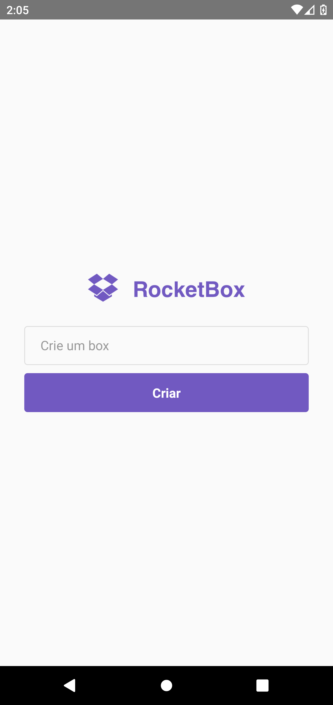
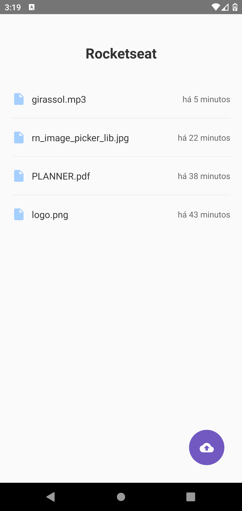
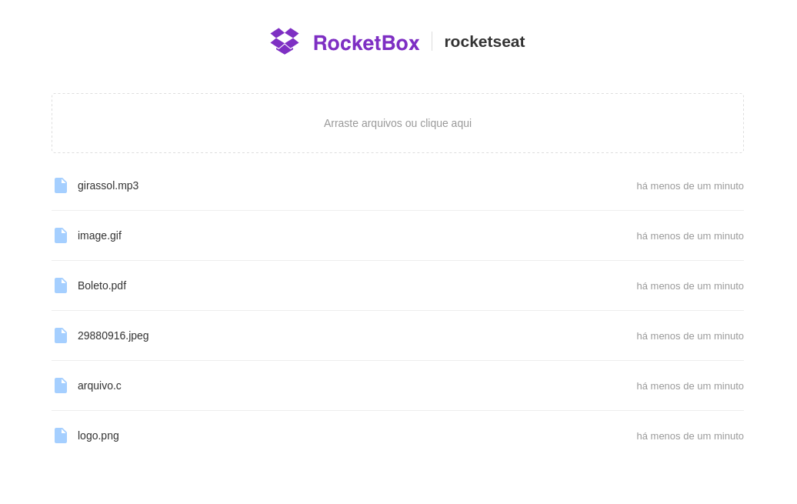

<h1 align="center">
  
</h1>

<h4 align="center">
  🚀 Semana OmniStack 6.0
</h4>

## 💻 Projeto

Projeto desenvolvido com base nas aulas do evento **Semana OmniStack 6.0**, oferecido pela [Rocketseat][rocketseat].
A ideia do projeto é reproduzir minimamente as funcionalidades e interface do Dropbox. Tendo como único propósito, o aprendizado de novas tecnologias para desenvolvimento de software.

## 🛠 Tecnologias

As seguintes tecnologias foram utilizadas no desenvolvimento do projeto:

- [Node.js][nodejs]
- [React][reactjs]
- [React Native][reactnative]

## 📷 Screenshots

### Mobile:

<kbd>
  
</kbd>

---

<kbd>
  
</kbd>

### Web:

<kbd>
  
</kbd>

---

<kbd>
  
</kbd>

[rocketseat]: https://rocketseat.com.br/
[nodejs]: https://nodejs.org/en/
[reactjs]: https://reactjs.org/
[reactnative]: https://facebook.github.io/react-native/
